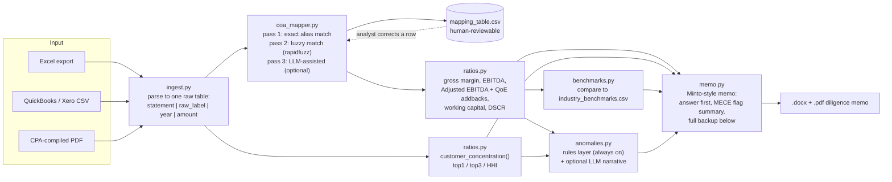

# SMB Quantitative Diligence Agent

An agentic pipeline that takes a small business's financial statements exactly as a seller would hand them over (a messy Excel export, a QuickBooks/Xero CSV, or a CPA-compiled PDF) and turns them into a structured, Minto-style buy-side diligence memo: gross margin, EBITDA and Adjusted EBITDA with an itemized quality-of-earnings addback worksheet, working-capital trend, customer concentration, debt-service coverage, and a red/yellow/green anomaly scan for the things that actually blow up small-business deals — revenue recognized ahead of cash, expenses that quietly move around right before a sale, undisclosed related-party transactions, and working capital gamed at the transaction date.

Three synthetic multi-year datasets are included so you can watch it work: one clean file, one with a subtle earnings-quality issue, and one with an obvious fraud pattern. The agent produces a different memo for each, with a different overall rating, for reasons you can check line by line.

**No client or employer data is used anywhere in this repository.** Every dataset is synthetic, generated by `scripts/generate_synthetic_data.py`, and modeled loosely on the kind of small business each demo represents. See the note at the top of each generated memo.

---

## Problem

A financial buyer, a search-fund operator, or an owner-operator doing an acquisition gets a data room full of statements that were never built to be compared to anything: different chart-of-accounts conventions, a QoE story buried in a spreadsheet nobody explains, and red flags that only surface if someone reads three years of financials line by line instead of skimming the multiple. Most small acquisitions don't get a real quantitative diligence pass, because a proper one is slow and the target is too small to justify a full advisory engagement. The gap isn't sophistication, it's throughput: somebody has to actually read the statements.

## Why I built it

Twenty years of operating roles taught me what this memo needs to say before I ever touched an agent framework. I ran the post-acquisition P&L at Dandrea Produce / Courchesne Larose — a ~$150M distribution business handed to me mid-turnaround — and took it from an acquisition-stressed balance sheet to 27% EBITDA in FY2019 and 28% in FY2020 before training my replacement and handing it back to the founding family. Before that, I led supply chain and margin work at Siemens Water Technologies (a 3-site manufacturing integration, Lean/Six Sigma, Theory of Constraints applied directly to bottleneck relief) and at Amazon (inventory strategy and open-to-buy for a high-volume category through peak). Those are exactly the instincts this agent encodes: what a *real* margin move looks like versus a manufactured one, why inventory that doesn't reconcile with sales is the first thing to check, and why a quality-of-earnings addback needs a documented reason, not just a plausible one.

The GRC and audit side is not incidental either. At WELD Seattle I stood up the organization's first-ever clean financial statement and single audits, and I hold the GRC Professional (GRCP), Integrated Compliance & Ethics Professional (ICEP), and Certified Non-Profit Accounting Professional (CNAP) credentials. That is why the anomaly detector in this repo is rules-based and fully transparent by default — every flag carries the exact numbers and threshold that tripped it — with an LLM used to narrate findings in plain English, never to decide what counts as a flag. In a diligence context "the model flagged it" is not an acceptable answer to "why," and I built this to reflect that.

The agentic tooling itself is the product of a deliberate, structured year applying AI to the operating and finance toolkit above: Claude Academy, an MIT MicroMasters in Finance (expected March 2026), the Integrated Artificial Intelligence Professional (IAIP) certificate from OCEG, and hands-on coursework in Python, agents, and RAG through freeCodeCamp. This repo is that combination applied to one concrete workflow, not a course exercise.

## Architecture



Every stage is its own module with one job:

| Module | Responsibility |
|---|---|
| `ingest.py` | Parses `.xlsx`, `.csv`, and `.pdf` (via `pdfplumber`) source statements into one consistent long-format table. Handles the formatting noise real exports carry: `$`, commas, accounting-style `(1,234)` negatives, merged year headers. |
| `coa_mapper.py` | Maps every raw label onto a ~30-item canonical chart of accounts (`schema.py`) in three passes — exact alias, fuzzy match, then LLM-assisted for what's left — and writes a CSV mapping table a human can correct before anything downstream trusts it. Unmapped labels are **excluded** from the financials, not guessed at. |
| `ratios.py` | Gross margin, EBITDA, the QoE addback worksheet (see below), working capital (both total and the M&A-standard "operating" cut), days-based metrics (DSO/DIO/DPO), DSCR, and customer concentration (top-1%, top-3%, HHI). |
| `benchmarks.py` | Compares the latest year's ratios against `data/reference/industry_benchmarks.csv`, a small, explicitly-cited, directional-only reference table. |
| `anomalies.py` | A threshold-based rules layer — always runs, no API key required — that catches revenue recognition risk (AR outgrowing revenue), expense-timing shifts (a COGS ratio that improves too fast to be organic), related-party transactions, working-capital moves clustered at the transaction date (payables stretched, distributions spiked), inventory/COGS incoherence, and customer concentration. An optional LLM pass turns each flag's raw evidence into a plain-English paragraph. |
| `memo.py` | Renders the Minto Pyramid-structured `.docx`: the governing thought (the answer) leads, the red/yellow/green flag summary is the MECE grouping of supporting arguments, and every number is available as backup further down. |
| `llm.py` | The only place `ANTHROPIC_API_KEY` is read. Every LLM-assisted step has a rules-only fallback, so the whole pipeline runs with zero configuration. |

**Why related-party expense is never auto-added-back:** a naive QoE tool adds back anything that looks "non-operating." This one deliberately does not — related-party expense is routed to the anomaly detector instead of the addback worksheet, because assuming it's fully avoidable is exactly the assumption a related-party transaction shouldn't get for free. The fraud-pattern demo (`fraud_co`) exists specifically to show this distinction mattering.

## How to run it

```bash
git clone https://github.com/kareembrantley-lab/Portfolio-Projects.git
cd Portfolio-Projects/smb-quant-diligence-agent
python3 -m venv .venv && source .venv/bin/activate
pip install -r requirements.txt

# Regenerate the synthetic datasets and run all three demo memos:
python scripts/run_diligence.py --demo

# Run the test suite:
pytest tests/ -v

# Run against your own statements:
python scripts/run_diligence.py \
  --name "Acme Distribution LLC" \
  --industry wholesale_distribution \
  --files path/to/income_statement.xlsx path/to/balance_sheet.xlsx \
  --out-dir output/acme
```

PDF rendering uses headless LibreOffice if it's installed (`soffice`/`libreoffice` on `PATH`); otherwise the pipeline still produces the `.docx` and simply skips the PDF conversion.

To turn on the LLM-assisted chart-of-accounts step and the plain-English anomaly narratives, set `ANTHROPIC_API_KEY` before running. Without it, the pipeline runs the same steps end-to-end on rules and templated language alone — the mapping table and every flag still get produced, just with the rules-only rationale text instead of an LLM-generated paragraph.

## Sample output

Running `--demo` regenerates the three source datasets and produces:

| Company | Industry | Format | Overall flag | What it catches |
|---|---|---|---|---|
| Cascade Valley Wholesale Foods | Wholesale distribution | Excel workbook | 🟢 GREEN | Nothing — margins, working capital, and concentration all clear cleanly. |
| Northgate Precision Components | Light manufacturing | 3 CSVs | 🟡 YELLOW | A gross margin that improves 6.8 points with no documented cause, a customer at 28% of revenue, and (in the QoE worksheet, not a hard flag) $220K of owner comp well above a market-rate replacement salary. |
| Summit Retail Supply Co | E-commerce / retail | 2 PDFs + CSV | 🔴 RED | Receivables growing ~100pp faster than revenue two years running, a 10-point COGS drop timed right before the sale, related-party fulfillment fees escalating to 4.2% of revenue, payables stretched 39 days at year-end, a distribution equal to 131% of Adjusted EBITDA the same year, and inventory that swings 90% with no matching sales change. |

Full generated memos for all three (`.docx` and `.pdf`) are in [`sample_output/`](sample_output/), alongside each run's `mapping_table.csv` so you can see exactly what got auto-mapped, what got fuzzy-matched, and what was excluded pending human review.

## What I'd do with more time

- **Cash flow statement ingestion.** Working capital is currently derived from balance sheet deltas; a real CF statement would let the agent reconcile reported EBITDA to actual cash generated, which is a stronger fraud tripwire than any balance-sheet ratio alone.
- **Bank statement cross-check.** Pulling a read-only bank feed (Plaid or similar) and reconciling reported revenue against actual deposits would close the biggest hole in the revenue-recognition check, which today only looks at AR growth versus revenue growth.
- **Industry benchmark depth.** `industry_benchmarks.csv` currently covers four industries with three data points each. A real deployment would connect to a licensed benchmarking source (RMA, BizMiner) with sub-industry granularity instead of the directional ranges here.
- **Multi-entity / consolidation support.** Real SMB acquisitions often involve two or three related entities (an OpCo and a PropCo, for instance). The schema assumes one entity today.
- **A confidence-weighted overall score** instead of a strict red-beats-yellow-beats-green rollup, so a memo with five borderline yellow flags reads differently than one with a single marginal yellow flag.

## Repository layout

```
smb-quant-diligence-agent/
├── src/smb_diligence/       # the agent: ingest, map, compute, detect, render
├── scripts/                 # generate_synthetic_data.py, run_diligence.py (CLI)
├── data/
│   ├── synthetic/           # the 3 demo datasets (clean_co, qoe_issue_co, fraud_co)
│   └── reference/           # industry_benchmarks.csv
├── sample_output/           # generated memos + mapping tables from --demo
├── tests/                   # pytest unit tests for the ratio/QoE/mapping logic
└── docs/architecture.md     # module-by-module data contracts
```

This project lives inside the [`Portfolio-Projects`](..) monorepo, so its CI workflow is at the repo root (`.github/workflows/tests.yml`) rather than inside this folder — GitHub Actions only reads workflows from the repository root.

## License

MIT — see [LICENSE](LICENSE).
